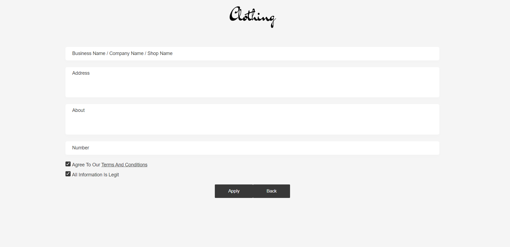
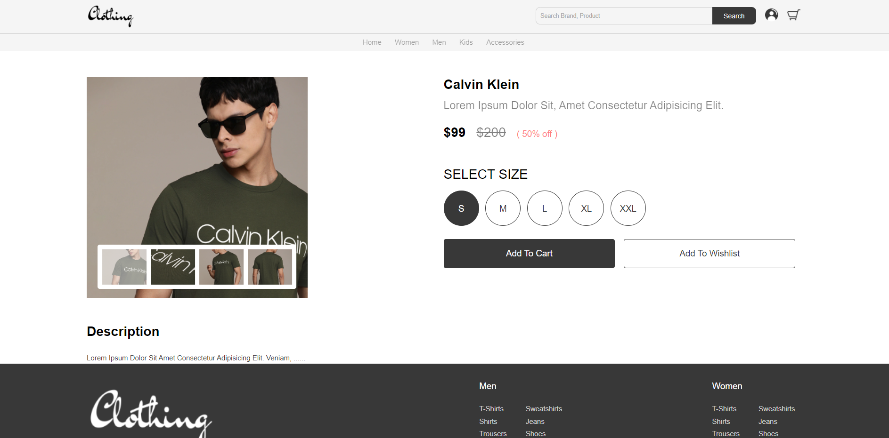
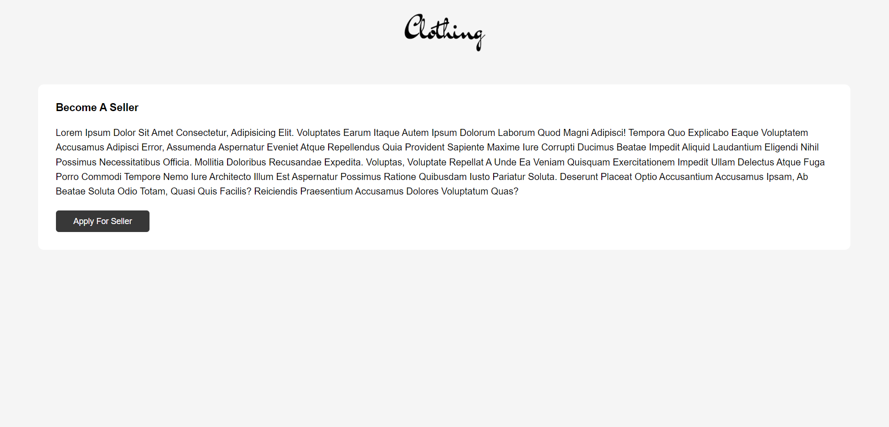
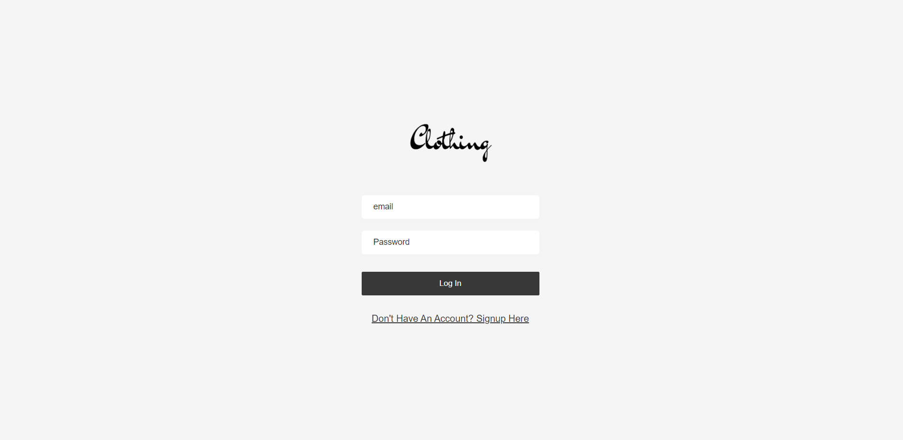
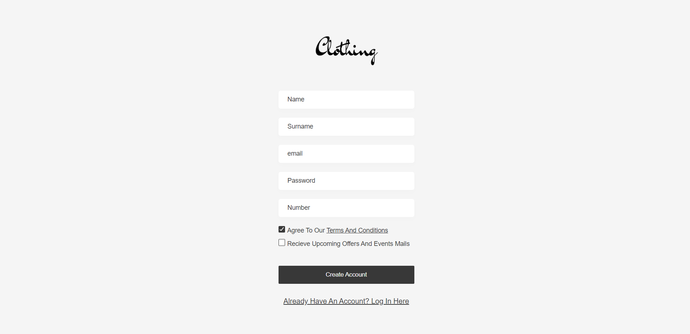

# E-Com Store

Hello, Today I got something exciting, we'll learn to create an e-commerce website using HTML, CSS and JS. This is a part of full stack e-commerce website. In this part we'll only create front end page's UI. We'll create 6 pages and a special page in this tutorial - Home page, Product Page, Search Page, 404 page, Seller Page

[click here to preview demo](https://e-com-store-sk.netlify.app/)

## Authors
- [@ShaneKolkoto](https://github.com/ShaneKolkoto)

## Tech Stack

**Client:** HTML, CSS, Javascript

## Screenshots
### Landing Page

### Search Page

## Seller Page

## Product Page

## Become Seller Page

## Login Page

## Signup Page

